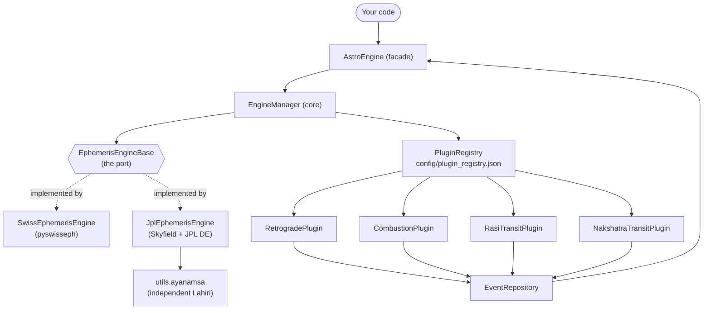

# Astro Engine

A modular, backend-agnostic **Vedic-astrology ephemeris and astronomical
event-detection** library for Python.

Astro Engine computes **sidereal** planetary positions (longitude, rasi,
nakshatra, pada, speed, direction) for the nine grahas and detects astrological
events (retrograde, combustion, sign/nakshatra ingress) over any date range. It
ships with two interchangeable calculation backends — **Swiss Ephemeris** and a
pure-Python **JPL DE (Skyfield)** backend — that agree to sub-arcsecond
accuracy.

```python
from astro_engine import AstroEngine

engine = AstroEngine(backend="swiss")
pos = engine.position("Mars", "2025-01-01", (17.385, 78.4867))
print(pos.rasi, pos.nakshatra, pos.pada, pos.dms)
# ZodiacSign.KATAKAM Nakshatra.PUSHYA 2 7° 47' 11" (Katakam)
```

---

## Table of contents

- [Features](#features)
- [Installation](#installation)
- [Quick start](#quick-start)
- [Concepts](#concepts)
- [Architecture](#architecture)
- [Backends](#backends)
- [The high-level API (`AstroEngine`)](#the-high-level-api-astroengine)
- [Plugins (event detection)](#plugins-event-detection)
- [The Vedic feature library (`astro_engine.vedic`)](#the-vedic-feature-library-astro_enginevedic)
- [Ayanamsa accuracy & validation](#ayanamsa-accuracy--validation)
- [Extending the engine](#extending-the-engine)
- [Testing](#testing)
- [Bug fixes & improvements over the original notebook](#bug-fixes--improvements-over-the-original-notebook)
- [Limitations](#limitations)
- [License](#license)

---

## Features

- **Sidereal positions** for the 9 grahas: Sun, Moon, Mars, Mercury, Jupiter,
  Venus, Saturn, Rahu (north lunar node) and Ketu (south node).
- **Rich derived data** per planet: zodiac sign (rasi), nakshatra, pada (quarter),
  degrees-minutes-seconds within sign, longitudinal speed, and direct/retrograde
  motion.
- **Lagna (Ascendant)** — the rising sidereal zodiac point for any date, time and
  place, on either backend. Validated against
  [drikpanchang.com](https://www.drikpanchang.com/) across past/recent/future dates.
- **Event detection plugins**: retrograde periods, combustion (proximity to the
  Sun) periods, rasi (sign) ingress, and nakshatra/pada ingress.
- **Two backends, one interface**:
  - `swiss` — [Swiss Ephemeris](https://www.astro.com/swisseph/) via
    `pyswisseph` (industry standard; Moshier fallback needs no data files).
  - `jpl` — NASA/JPL Development Ephemeris via
    [Skyfield](https://rhodesmill.org/skyfield/) + `jplephem`, with an
    **independent Lahiri ayanamsa** so it needs no Swiss dependency.
- **Ports-and-adapters + plugin architecture** — swap the ephemeris source or
  add new event detectors without touching the core.
- **Timezone-correct** throughout (`zoneinfo`), immutable value objects, and
  result caching for speed.

## Installation

The core package is dependency-light. Calculation backends are **optional
extras** — install the one(s) you want:

```bash
# Swiss Ephemeris backend (recommended default)
pip install "astro-engine[swiss]"

# JPL / Skyfield backend
pip install "astro-engine[jpl]"

# Both backends
pip install "astro-engine[all]"
```

From a local checkout:

```bash
pip install -e ".[all]"
```

> **Windows note:** the library resolves time zones via `zoneinfo`, which needs
> the IANA database. `tzdata` is installed automatically on Windows.

**Requirements:** Python ≥ 3.10.

## Quick start

```python
from astro_engine import AstroEngine

# Choose a backend: "swiss" (default) or "jpl".
engine = AstroEngine(backend="swiss")

# --- Point queries ---------------------------------------------------------
pos = engine.position("Jupiter", "2025-01-01", (17.385, 78.4867))
print(pos.longitude)   # 49.03...  (sidereal degrees)
print(pos.rasi)        # ZodiacSign.VRISHABAM
print(pos.nakshatra, pos.pada)
print(pos.dms)         # "19° 02' 01" (Vrishabam)"
print(pos.speed)       # deg/day; negative => retrograde

# All nine grahas at one instant:
for p in engine.positions("2025-01-01", (17.385, 78.4867)):
    print(p.planet.value, round(p.longitude, 3), p.rasi.value)

# --- Lagna (Ascendant) ------------------------------------------------------
asc = engine.lagna("2025-01-01 06:00", (17.3842, 78.4564), tz="Asia/Kolkata")
print(asc.rasi)        # ZodiacSign.DHANASSU  (Sagittarius rising)
print(asc.dms)         # "4° 56' 50" (Dhanassu)"
print(asc.nakshatra, asc.pada)
lon = engine.ascendant_longitude("2025-01-01 06:00", (17.3842, 78.4564), tz="Asia/Kolkata")

# --- Event detection -------------------------------------------------------
events = engine.find_events(
    start="2025-01-01",
    end="2025-12-31",
    location=(17.385, 78.4867),
    plugins=["retrograde", "combustion"],   # omit to run all plugins
    planets=["Mercury"],                     # omit for all planets
)
for e in events:
    print(e)
# Retrograde period for Mercury: 2025-03-15 12:16:10 IST -> 2025-04-07 16:37:40 IST
# Combustion period for Mercury: ...
```

Inputs are **coerced for you**: dates accept ISO strings, `datetime`, or `Date`;
locations accept a `Location` or a `(lat, lon[, elevation])` tuple; planets
accept a name string or `PlanetName`.

## Concepts

| Term | Meaning |
| --- | --- |
| **Sidereal** | Longitudes measured against the fixed stars (Vedic system), as opposed to the tropical (equinox-based) zodiac. |
| **Ayanamsa** | The offset between the tropical and sidereal zodiacs, growing ~50.3″/year due to precession. Default: **Lahiri** (Chitrapaksha). |
| **Rasi** | Zodiac sign — one of 12 arcs of 30°. Named here with South-Indian Sanskrit names (Mesham, Vrishabam, …). |
| **Nakshatra** | Lunar mansion — one of 27 arcs of 13°20′. |
| **Pada** | Quarter of a nakshatra (3°20′); 4 padas × 27 nakshatras = 108. |
| **Graha** | One of the nine "planets" incl. the lunar nodes Rahu/Ketu. |
| **Lagna** | Ascendant — the sidereal zodiac point rising on the eastern horizon at a given time and place; the anchor of a birth chart. |
| **Combustion** | A planet too close to the Sun to be visible; thresholds are per-planet. |

## Architecture

Astro Engine uses **ports & adapters** (hexagonal) for the ephemeris source and
a **plugin registry** for event detectors. The core orchestration never depends
on a concrete backend or a concrete plugin.



**Package layout**

```
astro_engine/
├── facade.py              # AstroEngine — the batteries-included entry point
├── adapters/
│   ├── base.py            # EphemerisEngineBase (the port / contract)
│   ├── swiss/             # Swiss Ephemeris backend
│   └── jpl/               # JPL DE + Skyfield backend  (NEW)
├── core/
│   ├── engine.py          # EngineManager — wires backend + plugins
│   ├── registry.py        # PluginRegistry — lazy JSON-driven plugin loading
│   ├── interface.py       # PluginInterface
│   └── exceptions.py      # AstroError / EphemerisError / PluginError
├── plugins/
│   ├── retrograde.py      # RetrogradePlugin
│   ├── combustion.py      # CombustionPlugin
│   └── transit.py         # RasiTransitPlugin + NakshatraTransitPlugin
├── vedic/                 # vectorized Vedic feature sub-libraries  (NEW)
│   ├── sky.py            # SkySampler → SkySample (the shared substrate)
│   ├── featureset.py     # FeatureSet container (categorical + boolean)
│   ├── features.py       # VedicFeatures facade (compute() + chart())
│   ├── tables.py         # classical reference tables
│   ├── signs.py  panchanga.py  bhava.py  varga.py  dasha.py
│   └── dignity.py  aspects.py  declination.py  cycles.py  stars.py  upagraha.py
├── models/                # immutable domain objects (Date, Location, …)
├── utils/
│   ├── ayanamsa.py        # independent Lahiri ayanamsa  (NEW)
│   ├── astrometry.py      # rasi / nakshatra / pada / DMS helpers
│   ├── datetime_utils.py
│   └── config_loader.py
└── config/
    ├── plugin_registry.json
    └── combustion_limits.json
```

### The ephemeris contract

Every backend implements `EphemerisEngineBase` so results are interchangeable:

| Method | Returns |
| --- | --- |
| `get_planet_longitude(planet, date, location)` | **Sidereal** ecliptic longitude, degrees `[0, 360)`. Geocentric by default. |
| `get_planet_speed(planet, date, location)` | **Geocentric tropical** longitudinal speed, deg/day. Sign → motion. |
| `get_planet_motion(planet, date, location)` | `MotionType.DIRECT` or `RETROGRADE`. |
| `name` | Short backend id (`"swiss"` / `"jpl"`). |

Speed is intentionally defined **geocentric + tropical** on both backends so
retrograde detection is observer-independent and identical across backends.
Ketu is defined as Rahu + 180°.

## Backends

Both backends produce Lahiri-sidereal longitudes that agree to **< 1.2″** for
all nine grahas (the lunar nodes match exactly, since both use the same mean-node
polynomial).

| | `swiss` | `jpl` |
| --- | --- | --- |
| Engine | Swiss Ephemeris (`pyswisseph`) | JPL DE kernel via Skyfield |
| Data files | None needed (Moshier fallback); optional `.se1` files for full precision | Downloads a `.bsp` kernel once (e.g. `de421.bsp`, ~17 MB) |
| Ayanamsas | Many (Lahiri, Raman, KP, …) | **Lahiri only** (pure-Python) |
| Node model | Swiss mean node | Meeus mean-node polynomial |
| Topocentric | `topocentric=True` | `topocentric=True` |
| Best for | Default, offline, all ayanamsas | JPL-grade positions, Swiss-free deployments |

```python
# Swiss (default). No download; uses the built-in Moshier ephemeris.
engine = AstroEngine(backend="swiss")

# Swiss with full-precision data files:
engine = AstroEngine(backend="swiss", ephe_path="/path/to/ephe")

# JPL: name is downloaded & cached on first use...
engine = AstroEngine(backend="jpl", ephemeris="de421.bsp")
# ...or point at an existing kernel file:
engine = AstroEngine(backend="jpl", ephemeris="/data/de440s.bsp")

# Topocentric (observer-based) longitudes — matters mostly for the Moon:
engine = AstroEngine(backend="jpl", topocentric=True)

AstroEngine.available_backends()   # ['swiss', 'jpl']
```

## The high-level API (`AstroEngine`)

```python
AstroEngine(backend="swiss", *, ayanamsa="Lahiri", topocentric=False, **backend_kwargs)
```

| Method | Description |
| --- | --- |
| `position(planet, when, location, *, tz=None)` | Full `PlanetaryPosition` (longitude, speed, rasi, nakshatra, pada, dms). |
| `positions(when, location, planets=None, *, tz=None)` | Positions of many planets (all nine by default). |
| `longitude(planet, when, location, *, tz=None)` | Just the sidereal longitude (degrees). |
| `lagna(when, location, *, tz=None)` | The `Ascendant` (rising sign, nakshatra, pada, dms). Alias: `ascendant(...)`. |
| `ascendant_longitude(when, location, *, tz=None)` | Just the sidereal Ascendant longitude (degrees). |
| `find_events(start, end, location, *, plugins=None, planets=None, tz=None)` | Run detectors over a range → `EventRepository`. |
| `backend` / `plugins` / `ephemeris` | Introspection properties. |
| `available_backends()` | Static list of registered backends. |

`tz` sets the zone for naive/string inputs; by default it uses the location's
timezone (Asia/Kolkata unless you build a `Location` with another zone).

## Plugins (event detection)

Plugins are discovered from `config/plugin_registry.json` and loaded lazily.

| Plugin name | Detects | Notes |
| --- | --- | --- |
| `retrograde` | Retrograde **periods** (station-to-station) | Uses speed-sign crossing with a stepping bracket search for the exact stations. |
| `combustion` | Combustion **periods** (planet near the Sun) | Per-planet thresholds in `config/combustion_limits.json`, with separate direct/retrograde limits. |
| `rasi_transit` | Sign-ingress **instants** | Bisection-refined to the second. Moon sampled every 6 h. |
| `nakshatra_transit` | Nakshatra **and pada** ingress instants | Fires on every pada boundary (≈ every 6 h for the Moon). |

```python
events = engine.find_events(
    start="2025-01-01", end="2025-06-30",
    location=(17.385, 78.4867),
    plugins=["retrograde"],
    planets=["Mercury"],
)
# Filter / inspect the repository:
for e in events:
    print(e.event_type, e.planet.value, e)
```

Combustion thresholds (degrees from the Sun) are fully configurable:

```json
{
  "Mercury": { "direct": 17.0 },
  "Venus":   { "direct": 10.0, "retrograde": 8.0 },
  "Jupiter": { "direct": 14.0, "retrograde": 12.0 }
}
```

## The Vedic feature library (`astro_engine.vedic`)

The scalar `AstroEngine` answers *point* questions ("where is Mars now?",
"when does Mercury go retrograde?"). Its sibling `astro_engine.vedic` answers
*bulk* questions — it turns **arrays of instants (and places)** into **arrays of
classical jyotish features**, vectorized end to end, so a single chart and a null
of a million random moments run through the identical code path. It was built to
feed statistical studies (e.g. the earthquake battery in `research/`) but the same
facade also prints a single, human-readable chart.

Everything is a pure function of one shared substrate,
`SkySample` — a bundle of numpy arrays (per body: tropical/sidereal longitude,
ecliptic latitude, RA, declination, distance, speed, retrograde flag; per instant:
ayanamsa, true obliquity, RAMC, ascendant). The substrate reuses the validated JPL
backend, so its numbers reproduce the scalar engine to sub-arcsecond precision.

### Use-case sub-libraries

Each Vedic use case is its own module exposing `features(sample) -> FeatureSet`:

| Module | What it derives |
| --- | --- |
| `signs` | Sidereal rasi of every graha + the ascendant (Sun's sign doubles as a season control) |
| `panchanga` | Tithi, paksha, karana, yoga, Moon's nakshatra + pada, vara (weekday) |
| `bhava` | Whole-sign house of every graha from the Lagna; dusthana flags |
| `varga` | Divisional-chart sign — D1/D2/D3/**D9**/D10/D12/D30/D60 (Navamsa in the battery) |
| `dasha` | Vimshottari mahadasha lord of the moment; full period timeline for a chart |
| `dignity` | Exalt/own/friend/neutral/enemy/debilitated state, combustion, graha yuddha, stationary |
| `aspects` | Western/Ptolemaic aspects, Vedic graha-drishti, declination parallels/contraparallels |
| `declination` | Out-of-bounds flags, N/S hemisphere, lunar-nodal major/minor standstills |
| `cycles` | Slow outer-planet pair phases (Jupiter–Saturn … Neptune–Pluto) for mundane astrology |
| `stars` | Conjunctions of Sun/Moon/Lagna with prominent fixed stars + the Galactic Centre |
| `upagraha` | Gulika/Mandi sign and a day/night flag (approximate) |

### A single chart

```python
from datetime import datetime, timezone
from astro_engine.vedic import VedicFeatures

vf = VedicFeatures()  # uses $ASTRO_KERNEL or downloads de421.bsp
chart = vf.chart(datetime(2024, 1, 1, 12, tzinfo=timezone.utc), 28.6139, 77.2090)

print(chart["ascendant"]["sign"])          # Gemini
print(chart["planets"]["Saturn"]["dignity"])  # own  (Saturn in Aquarius)
print(chart["panchanga"]["tithi"])         # Krishna Shashthi
print(chart["vimshottari"][0]["lord"])     # running mahadasha lord
```

### Bulk feature extraction

```python
import pandas as pd
from astro_engine.vedic import VedicFeatures

vf = VedicFeatures(exclude=["stars", "upagraha"])   # or include=[...] to focus
times = pd.date_range("1990-01-01", periods=100_000, freq="7h", tz="UTC")

fs = vf.compute(times, latitude=35.0, longitude=139.0)   # one FeatureSet
counts, n = fs.categorical_counts("moon_nakshatra")       # 27-way histogram
n_true, n_tot = fs.flag_count("Moon_out_of_bounds")       # boolean rate
```

Every feature is either **categorical** (an integer category per instant, tested
with chi-square) or a **boolean flag** (tested with a binomial) — a uniform shape
that lets a study loop over *all* features generically and pool a null cheaply.
`FeatureSet` records each feature's category names and `family`, so results group
themselves. Selecting `include=`/`exclude=` modules keeps the feature count (and
the multiple-comparison burden) under control.

## Ayanamsa accuracy & validation

The JPL backend contains an **independent Lahiri ayanamsa** so it does not need
Swiss Ephemeris. It is a cubic in Julian centuries from J2000:

```
ayanamsa(°) = 23.857092 + 1.3968880·T + 3.0709e-04·T² + 9.69e-09·T³
              T = (JD_UT − 2451545.0) / 36525
```

The coefficients were least-squares fit to Swiss Ephemeris `SIDM_LAHIRI`
(quarterly, 1800–2100) and reproduce it to **better than 0.0001″** across
1900–2100. The leading term (`1.39689°/century = 5028.80″/century`) is exactly
the IAU general-precession rate, confirming the expansion is physically
meaningful rather than an arbitrary curve fit. See `tests/test_ayanamsa.py`.

Other ayanamsas (Raman, KP, …) are available on the **Swiss** backend only; the
JPL backend raises `NotImplementedError` for them.

### Lagna (Ascendant) validation

The Ascendant is computed from apparent local sidereal time, the true obliquity
(mean obliquity + IAU-2000B nutation) and the observer's latitude, then reduced
to the sidereal zodiac with the Lahiri ayanamsa. Sidereal time is derived
directly from the **UT** Julian Day (the IAU-1982 GMST series) rather than from a
ΔT/UT1-routed value — a subtlety that keeps far-future dates correct (a naive
`gast`-based model drifts by tens of arcminutes by 2200).

Validated against **drikpanchang.com** (Lahiri / Chitra-Paksha, Swiss Ephemeris)
for Hyderabad, India (17.3842° N, 78.4564° E, Asia/Kolkata) across three eras —
both backends reproduce the rising sign exactly:

| Date & time (IST) | Era | drikpanchang | Swiss backend | JPL backend |
| --- | --- | --- | --- | --- |
| 1900-03-21 05:45 | very past | Aquarius | Aquarius (328.07°) | Aquarius (328.08°) |
| 2025-01-01 06:00 | recent | Sagittarius | Sagittarius (244.95°) | Sagittarius (244.95°) |
| 2076-06-15 12:30 | very future | Virgo | Virgo (153.07°) | Virgo (153.07°) |

The independent Swiss and JPL backends agree on the Ascendant to **≤ 16″** over
1900–2200. Because the Swiss backend *is* `pyswisseph` + Lahiri — the same engine
family drikpanchang runs — its Ascendant matches drikpanchang to the arcsecond
for identical coordinates. See `tests/test_lagna.py`.

## Extending the engine

**Add a new event-detection plugin**

```python
# my_pkg/full_moon.py
from astro_engine.core.interface import PluginInterface
from astro_engine.models.event_repository import EventRepository

class FullMoonPlugin(PluginInterface):
    @property
    def name(self) -> str:
        return "full_moon"

    def run(self, context, ephemeris) -> EventRepository:
        repo = EventRepository()
        # ...detect events using ephemeris.get_planet_longitude(...)...
        return repo
```

Register it by adding a line to `config/plugin_registry.json` (or a custom
registry file passed to `PluginRegistry`):

```json
{ "full_moon": "my_pkg.full_moon.FullMoonPlugin" }
```

**Add a new ephemeris backend** — implement `EphemerisEngineBase` and register
its dotted path in `astro_engine/core/engine.py` (`_ADAPTER_PATHS`).

## Testing

```bash
pip install -e ".[test]"
pytest -q
```

The suite (43 tests) covers the domain models, the ayanamsa fit (validated
against Swiss Ephemeris), both backends, Swiss-vs-JPL parity, and the facade +
plugins. Tests **skip gracefully** when an optional backend or a JPL kernel is
unavailable. To point the JPL tests at an existing kernel instead of
downloading one:

```bash
# PowerShell
$env:ASTRO_TEST_DE_KERNEL="C:\path\to\de421.bsp"; pytest -q
# bash
ASTRO_TEST_DE_KERNEL=/path/to/de421.bsp pytest -q
```

## Bug fixes & improvements over the original notebook

This library is a faithful extraction of the original `Astral_modules` notebook,
with the following corrections and enhancements:

**Correctness**
- **Retrograde stations**: the "already retrograde at the start of the range"
  case used a fixed 365-day bracket with single-crossing bisection, which could
  converge on the wrong station for fast movers (Mercury flips ~3×/year). Now
  uses a stepping bracket search to isolate each real station.
- **Motion classification** compared raw strings; now derived from the sign of
  the speed via the `MotionType` enum.
- **Topocentric bug (Swiss)**: the original set the observer with `set_topo` but
  never passed `FLG_TOPOCTR`, so results were silently geocentric. Topocentric
  is now an explicit opt-in that sets the flag correctly.
- **Hard-coded Colab ephemeris path** removed; the Swiss backend now falls back
  to the built-in Moshier ephemeris when no data path is given.
- **`Date` timezone/hash**: UTC detection now uses `utcoffset()`, and `__hash__`
  is consistent with instant-based equality.
- **DMS formatting** now shows degrees **within the sign** (0–30), not the whole
  circle.
- Removed a duplicated `test_from_iso_with_aware` and replaced it with real
  coverage of the naive-string path.

**New capabilities**
- **JPL DE / Skyfield backend** (`adapters/jpl/`) implementing the full port.
- **Independent Lahiri ayanamsa** (`utils/ayanamsa.py`), validated against Swiss.
- **`AstroEngine` facade** with input coercion.
- **Packaging** (`pyproject.toml`) with optional-dependency extras.

**Robustness & performance**
- Thread-safe access to Swiss Ephemeris' global sidereal/topocentric state.
- Result caching in both backends; lazy backend imports so installing one
  backend's dependency is enough.
- `print()` replaced with the `astro_engine` logger.

## Limitations

- Rahu/Ketu use the **mean** lunar node (not the true node) on the JPL backend;
  the Swiss backend uses its mean node too for parity.
- The JPL backend implements **Lahiri only**. Use the Swiss backend for other
  ayanamsas.
- Longitudes are geocentric unless `topocentric=True`; the difference is
  significant only for the Moon.
- This is an **astronomy** engine that exposes data used in **Vedic astrology**.
  The positional calculations are rigorous and validated; any astrological
  *interpretation* built on top is cultural/traditional and outside the scope of
  scientific claims.

## License

MIT. See the license field in `pyproject.toml`.
